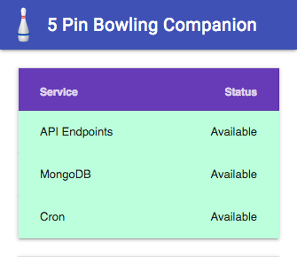

# Bowling Companion Transfer

## Description

A web utility to allow users of [5 Pin Bowling Companion](https://play.google.com/store/apps/details?id=ca.josephroque.bowlingcompanion) for Android to transfer their data to a new device.

Visit [api.bowlingcompanion.ca](http://api.bowlingcompanion.ca) for status of the API.

## Contributing

Ensure MongoDB is running by starting it with

```
$ mongod --config /usr/local/etc/mongod.conf
```

Build and start the server with

```
$ yarn build
$ yarn start:dev
```

Make your changes and view them at `http://localhost:8080`

Before committing, ensure your changes pass linting:

```
yarn lint
```

## Screenshots



## License

```
Copyright (C) 2016-2019 Joseph Roque

Licensed under the Apache License, Version 2.0 (the "License");
you may not use this file except in compliance with the License.
You may obtain a copy of the License at

http://www.apache.org/licenses/LICENSE-2.0

Unless required by applicable law or agreed to in writing, software
distributed under the License is distributed on an "AS IS" BASIS,
WITHOUT WARRANTIES OR CONDITIONS OF ANY KIND, either express or implied.
See the License for the specific language governing permissions and
limitations under the License.
```